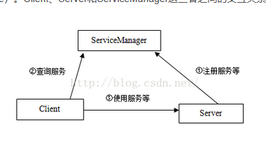

[参考]：https://kernel.meizu.com/2019/01/02/11-38-02-android-binder/#2-1%E3%80%81service-manager%E7%9A%84%E5%88%9D%E5%A7%8B%E5%8C%96

# 背景
binder是android系统基于Linux增加的进程间通信机制，所以作为一个android开发者，需要深入了解binder。要理解binder需要对操作系统的有深入的了解，如下：
- 系统调用
- 驱动文件
- mmap文件映射

# binder原理分析
基于cs架构，服务初始化的时候需要去serviceMasnager进行注册，client需要使用某个服务需要先去serviceManager获取一个叫handle(可以理解为远程binder对象的一个引用)的东西（保存在serviceManger）



- mmap文件映射实现了每次通信的1次拷贝
- 为什么要抽象出serviceManager一层？
- 如何通过handle（server初始化的时候要把binder保存在serviceManger）知道自己的通信的进程的
相信回答了以上三个问题，你对binder的理解就会更加深刻


## mmap实现一次拷贝
我们正常的进程间通信如socket是需要一次通信的，进程只能访问到所属页表指向的内容，要想实现共享常用的方法就是两次拷贝，以内核为中转站，通过系统调用的方式，把消息挂载到target进程的pcb上，进程切换的时候再又内核把内容复制到进程的用户空间。mmap的好处是可以让一次通信只需要一次拷贝（但是整个binder调用的过程需要多次拷贝）


## 为什么要抽象出serviceManager？

如果没有serviceManager我们如何完成binder通信？每个client在启动的时候都要请求server注册自己的binder对象到所有的client，这样建立起binder和远程引用之间的关系，这样每个client进程（大概率是app应用进程）就要承担服务注册和查询能力，这样做的好处是查询速度更快，但是坏处就是所有的应用进程都要提供服务的注册和查询能力，职责不够清晰。

## 整个binder通信的细节
我们用一个完整的流程来描述binder通信的过程
通信之前我们要先引入几个数据结构
binder_proc：每个进程如果要使用binder的能力，那就需要调用binder驱动来保存下面数据结构进行管理

```java
struct binder_proc {
    struct hlist_node proc_node; //用于添加到哈希表binder_procs
    struct rb_root threads; //用于管理进程中所有线程的红黑树
struct rb_root nodes; //进程中的所有binder实体都会创建一个binder_node,并插入到该红黑树
/*进程访问过的所有binder server都会创建一个引用结构binder_ref, 该结构会同时插入下面两个红黑树. 红黑树refs_by_desc的key为desc, 红黑树refs_by_node的key为node(binder在进程中的地址) */
    struct rb_root refs_by_desc;
    struct rb_root refs_by_node;
......
    struct list_head todo; //用于连接进程待处理的事务
wait_queue_head_t wait;//等待队列,等待可处理的事务
......
}

```

binder_thread：我的理解这个binder_thread主要应用在服务方，服务方运行binder实体代码需要

```java
struct binder_thread {
    struct binder_proc *proc; //线程所属的binder_proc
    struct rb_node rb_node;//用于插入proc->threads
......
struct binder_transaction *transaction_stack; //线程传输数据管理结构t链表
//传输数据添加到target_proc->todo中之后会添加一个tcomplete到这里
struct list_head todo; 
......
wait_queue_head_t wait;
......
};

```

binder_node：用来管理一个进程的所有binder实体的数据结构

```java
struct binder_node {
......
    struct binder_proc *proc;//binder实体所属进程的proc
    struct hlist_head refs; //引用该binder实体都会添加一个binder_ref到该哈希表
    int internal_strong_refs;//binder实体引用计数
......
    binder_uintptr_t ptr; //binder实体在进程应用空间的引用
    binder_uintptr_t cookie;//binder实体在应用空间的地址
......
}

```


binder _ref：binder对象的远程引用方会维持这个节点，这个是获取到目标进程及其binder实体的关键，后续会细讲。其中desc其实就是一个当前进程的唯一值，当前进程拿到这个值然后通过系统调用就可以拿到通信目标进程的信息

```java
struct binder_ref {
    struct rb_node rb_node_desc; //用于插入红黑树proc->refs_by_desc
    struct rb_node rb_node_node;//用于插入红黑树proc->refs_by_node
    struct hlist_node node_entry;//用于插入哈希表binder_node->refs
    struct binder_proc *proc;//引用所属进程的proc
    struct binder_node *node;//binder实体
    uint32_t desc; //binder实体引用在当前进程proc中的编号
......
}

```

***


- servicemanager初始化：就是在内核建立以上的数据结构，其中会有个handle0作为一个全局的引用被binder驱动保存，任何进程使用binder驱动访问serviceManager的时候都可以在binder驱动中拿到handle0进而拿到serviceManager的binder_node节点进行后续处理
- server向servicemanager注册binder：注册的过程会在server进程维护binder_node信息维护binder实体，为servicemanager进程维护binder_ref信息（一棵红黑树），在servicemanger的进程用户空间实际维护了key，value格式， key是一个hash，value是一个handle（用于在servicemanger进程的引用红黑树列表拿到binder_ref进而知道目标binder实体）
- client获取服务：通过binder驱动拿到handle0然后查找到指定key服务的handle，然后把这个hande转换为client进程可用的handle（其实就是把servicemanager中保存的binder_ref保存到client的binder_proc数据结构上，需要改变binder_ref的desc值，其实就是client可用的handle），client可以基于这个handle通过binder驱动调用到对应进程的服务


