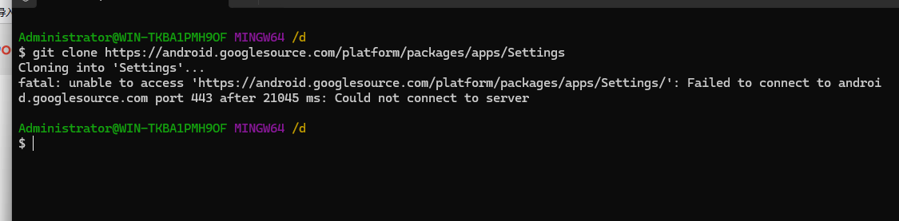

# framework源码调试指南

## 背景

准备开始接触androidframework相关的东西了，但是framework源码非常庞大，想要理解源码首先要学会对源码断点。目前有两种方式，可根据自己的需求来
- 拉取部分模块源码断点调试，不需要下载整个aosp

 我在家捣鼓了一天，被一个代码拉取卡住了。被一个443端口无法连接卡住。即使设置了全局代理也无效
 
 因此去研究了代理相关的原理：终端使用的网络配置和系统使用的全局代理不一样，需要单独设置，我只是在浏览器设置了代理，所以浏览器可以访问谷歌的域名

 所以解决问题的办法就是为终端设置正确的代理，这个问题根据某个大佬的推文解决了：[终端具备代理能力]：https://mp.weixin.qq.com/s/by0LgHHSGJLNibngoYUGzA

 

经过上面对终端代理的设置，成功拉取了setting模块的代码，然后创建新的工程把代码导入android项目即可

- 通过repo来进行管理下载整个asop的源码。这种方式适用于需要对asop进行一些自定义操作的时候使用

下面直接贴上某个大佬的连接，后续再尝试[android源码编译环境搭建]：https://weishu.me/2016/12/30/simple-way-to-compile-android-source/

- 其他：为什么终端代理设置成功之后，依然无法ping通谷歌的域名
因为ping使用的icmp是一个网络层协议，而代理是对tcp的封装，作用再传输层，无法影响到ping指令的使用