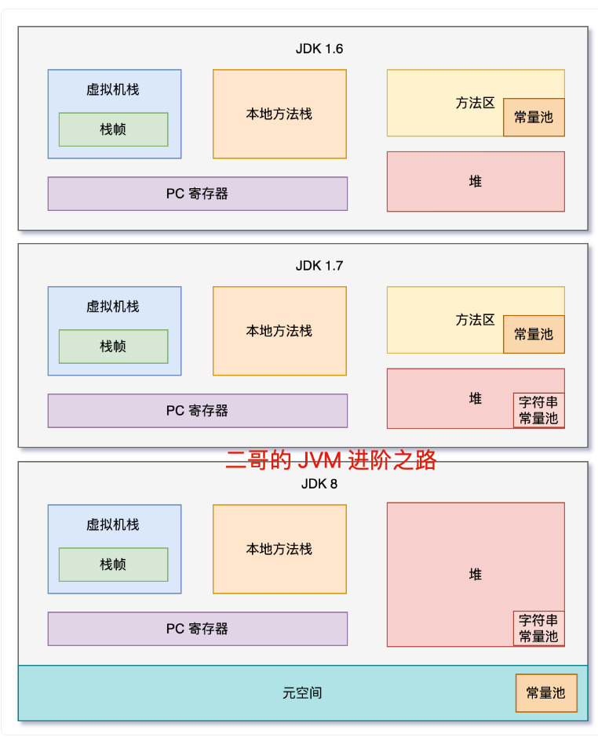

# jvm相关知识

[参考] https://javabetter.cn/jvm/jit.html

## 类加载相关

- 类加载原则：双亲委派机制，保证了类加载的唯一性质
- 加载流程
  - 载入：把class文件载入内存的方法区，生成代表该类的Class对象
  - 验证：方法字段的访问权限是否合理、方法参数是否合理、变量使用前是否初始
  - 准备：静态变量的初始化
  - 解析：把常量池中的符号引用转化为直接引用
  - 初始化：调用类的默认构造方法

## class文件的结构

class文件描述了一个类的所有信息，加载到内存之后主要放在我们的方法区域，且可以帮助Class对象的生成

- 常量池：包含了所有方法、字段、属性、字面量的描述
- 字段表：类的字段，包含了访问权限、描述符
- 方法表：类的方法访问权限、签名等
- 属性：方法的属性就是code
- 类、父类、接口索引

## java的运行时数据区

- 堆：对象存储的区域，所有线程共享
- pc寄存器：线程私有，对于每个线程都指向当前执行的字节码指令
- 虚拟机栈：每一个方法有一个栈帧，里边包含局部变量表、操作数栈
- 本地方法栈：native方法的执行管理
- 方法区：class文件加载的地方，类相关的信息都在这里

## 垃圾回收机制

垃圾回收主要知道两个东西，一个是垃圾判断算法，一个是回收算法
### 垃圾判断算法

- 引用计数法：c++中使用，存在循环引用的问题
- 可达性分析算法：从gc root出发，找到没有被强引用的对象

### 回收算法

分代机制：新生代、老年代。根据对象在gc过程中存活的时间被分配到不同的区域，对于不同的区域采取不同频率和程度的gc，可以提高gc的效率以及gc对应用的影响