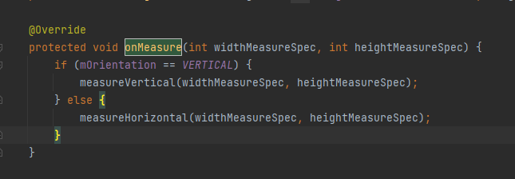
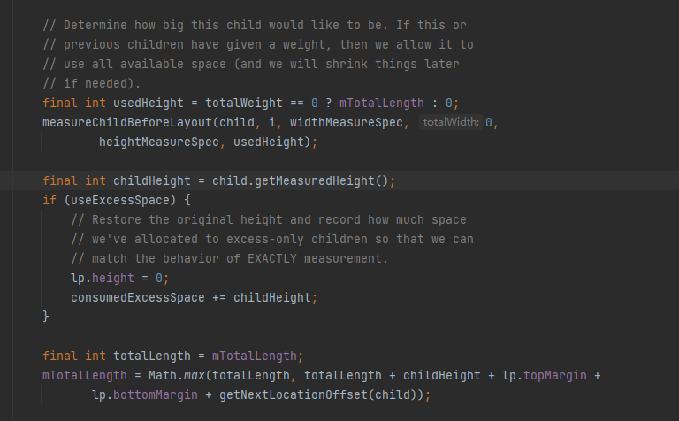

# 背景
想要精通自定义view的书写就要对view的measure和layout过程非常了解，draw可以直接使用绘制能力
了解之前需要熟悉一些基本的概念
- measure：测量view的宽高，对于view来说只需要测量自己，对于viewgroup需要测量子view
- layout：根据margin，padding，gravity等属性来确定view的最终位置坐标
- measureSpec：帮助确定view的最终宽高，由于父布局的measureSpec和子布局的LayoutParams共同决定。measureSpec由specMode和specSize组成
    - exactly：表明提供了确切的高度
    - amostly：提供了一个可用的有上限的高度

# measure过程

对于view来说，提供了measure开启测量，onMeasure完成测量。
如果自己要改变viewGroup的measure方式，就需要重写measure方法，下面从常用的LinearLayout进行分析
首先当linearlayout父布局开始measure的时候会调用到linearlayout的measure方法进而调用到重写的onMeasure
**根据布局方向**选择不同的布局方式

我们从vertical进行分析
顺序遍历所有子view，不断计算累计的高度，最后累计高度设置为自己的已测量高度

# layout过程

layout过程比较简单，由于宽高都有了，只需要根据padding，margin，gravity信息设置view的具体的坐标即可，先设置父布局的，再设置子布局的 

# 实践阶段

如何设计一个历史搜索组件
需要实现的核心功能如下
- 水平间歇和上下间歇的设置，支持通过xml属性的方式传入
- 重写onMeasure方法：计算自定义的最终宽高，规则是从左往右，从上到下依次排列
- 重写onLayout方法：对每个子view进行放置

