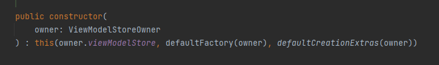

# viewModel相关
## 背景

今天得物二面被问到viewModel原理，当时没有回答上来，下面会基于viewmodel解决的问题和几个关键点进行分析

首先viewmodel的出现是为了解决activity旋转的时候，数据需要经过onRestoreInstance回调处理，当activity需要恢复的数据量比较大的时候十分麻烦，而viewmodel的出现可以对成员属性进行管理，不用手动恢复

viewModel有两个关键点
= 如何保证一个作用域（activity实例）获取的viewmodel是同一个
= activity旋转的时候会销毁上一个activity，创建新activity，那么如何保证新的activity中持有viewModelStore信息

## 源码分析

下面带着上面两个疑问进行源码分析

我们从viewModel的创建流程分析，其中主要的类为ViewModelProvider，他把viewModel的获取进行了封装

这是provider对象创建最常用的构造函数，里面传入了一个ViewModelStoreOwner，compactActivity和fragment都实现了该接口，提供了viewModelStore的获取能力

下面再看get方法，通过传入一个想要获取的viewModel的class对象，其中key就是viewModel的class对象的全限定名 

而viewModelStore内部是一个hashMap保存当前activity的所有viewModel。这也解决了为什么同一个作用域相同的class对象可以获取到同一个viewMode实例

***

继续分析第二个问题，activity作为viewModelStoreOnwer，如何保证旋转前后拿到的viewModelStore是同一个

通过getLastNoConfigurationInstance，可以旋转时已经onDestroy的activity的NoConfigurationInstance，这个信息会通过跨进程通信的方式

新activity重新创建的时候，会从activitythread的ActivityClientRecord的map中通过activity的全限定名去拿到上一个activity的ActivityClientRecord，进而拿到相关的viewModelStore信息

## todo，画出viewmodel的引用关系图