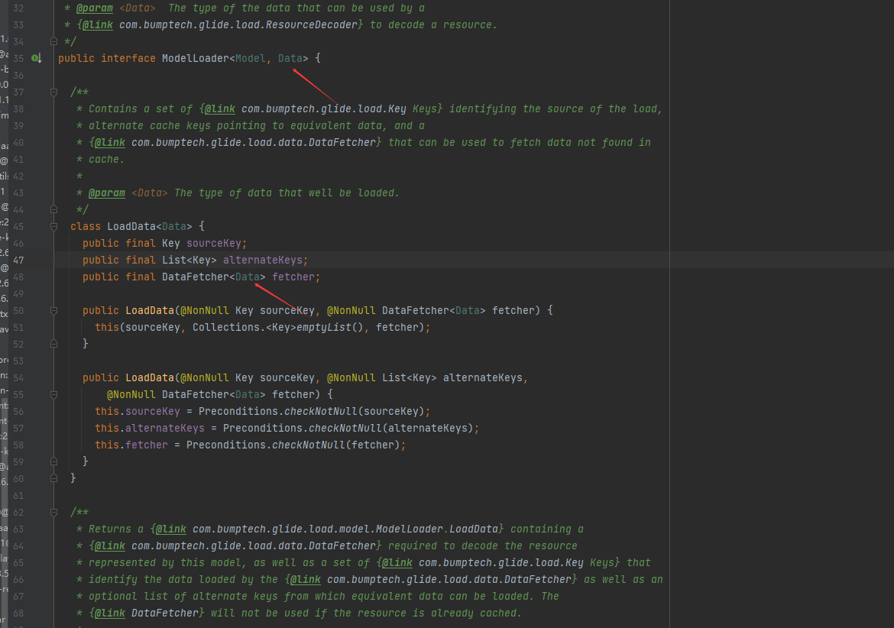
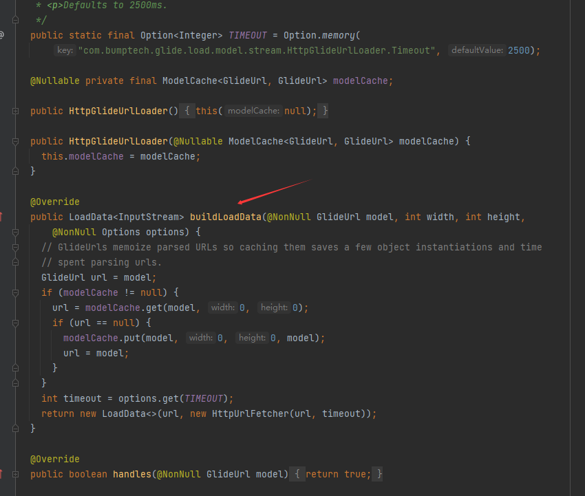

[基本架构] (https://sniffer.site/2017/05/20/glide%E8%AF%A6%E8%A7%A3%E4%B9%8B%E6%9E%B6%E6%9E%84%E5%88%86%E6%9E%90/#/%E6%9E%B6%E6%9E%84%E5%8F%8A%E5%B7%A5%E4%BD%9C%E5%8E%9F%E7%90%86)

# 基本使用
```java 
Glide.with(this).load(url).into(image)
```

- with：获得requestManager，与传入的activity的生命周期进行绑定（通过lifeCycle） 
- load：requestBuilder
- into
    - 构建request
    - engine：构建decodeJob（执行任务）
  
***
详细流程
```jAVA
  private void runWrapped() {
    switch (runReason) {
      case INITIALIZE:
        stage = getNextStage(Stage.INITIALIZE);
        currentGenerator = getNextGenerator();
        runGenerators();
        break;
      case SWITCH_TO_SOURCE_SERVICE:
        runGenerators();
        break;
      case DECODE_DATA:
        decodeFromRetrievedData();
        break;
      default:
        throw new IllegalStateException("Unrecognized run reason: " + runReason);
    }
  }

```
- intialize：根据当前url的缓存情况看看是否能够从resourseCache或者dataCache里边拿到数据
- source：如果前面一步拿不到，就从网络拿数据
- decode：把网络数据解码成image可以消费的格式

***

**一次url格式的image转换分析**


数据获取都是从Generator出发进行获取的
- ResourseCacheGenerator：本地resourese资源
- DataCacheGenerator：磁盘缓存
- SourceGenerator：网络资源

***
下面我们分析SourceGenerator开始分析

**TODO 后续补充调用链路的图**


可学习的代码格式
代码的高内聚
```java
public interface ModelLoader<Model, Data> {

  class LoadData<Data> {
    public final Key sourceKey;
    public final List<Key> alternateKeys;
    public final DataFetcher<Data> fetcher;

    public LoadData(@NonNull Key sourceKey, @NonNull DataFetcher<Data> fetcher) {
      this(sourceKey, Collections.<Key>emptyList(), fetcher);
    }

    public LoadData(@NonNull Key sourceKey, @NonNull List<Key> alternateKeys,
        @NonNull DataFetcher<Data> fetcher) {
      this.sourceKey = Preconditions.checkNotNull(sourceKey);
      this.alternateKeys = Preconditions.checkNotNull(alternateKeys);
      this.fetcher = Preconditions.checkNotNull(fetcher);
    }
  }
             the resource should be loaded at its original height.
   */
  @Nullable
  LoadData<Data> buildLoadData(@NonNull Model model, int width, int height,
      @NonNull Options options);

   */
  boolean handles(@NonNull Model model);
}

```

**为什么LoadData为内部类？**
我的理解是这样只有实现了ModelLoader的的实例对象才能访问，这样直接通过buidLoadData方法创建自己的LoadData
还有一个更重要的点是，loadData的泛型要和外部类一致，非静态内部类可以访问外部类的实例属性，所以才这样


每个ModelLoader和DataFetcher唯一对应


通过实现buildLoadData方法，建立起ModelLoader和dataFetacher之间的联系，实现了**高内聚的效果**


